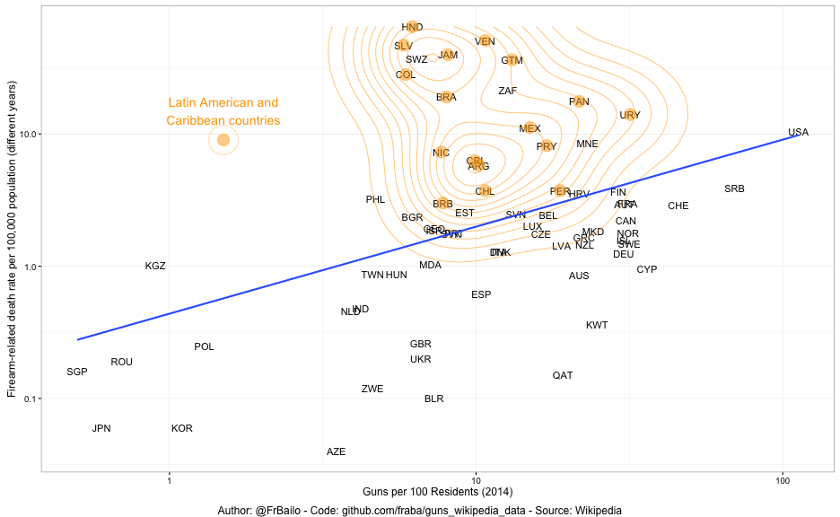

I base the analysis on crowdsourced data published on Wikipedia:


```r
ownership_url <- "http://en.wikipedia.org/wiki/Number_of_guns_per_capita_by_country"
death_url <- "https://en.wikipedia.org/wiki/List_of_countries_by_firearm-related_death_rate"
lac_url <- "https://en.wikipedia.org/wiki/List_of_Latin_American_and_Caribbean_countries_by_GDP_(PPP)"
```

The `httr` and `XML` libraries take care of pulling the data from the Wikipedia pages. `ggplot2` renders the plot, `countrycode` converts country names into ISO codes to merge the different data frames, and `stargazer` print the regression output in HTML format.


```r
require(httr)
require(XML)

require(ggplot2)
require(gridExtra)

require(countrycode)

require(stargazer)
```

First I need to download the Wikipedia page containing the data, which I pull with `GET`. Then I need to parse the HTML table and shape it into a R dataframe with `readHTMLTable`. `readHTMLTable` might return a list containing more than a tables, I need to find which one is of interest. 


```r
# Ownership
tabs <- GET(ownership_url)
tabs <- readHTMLTable(rawToChar(tabs$content), stringsAsFactors = F)
ownership_df <- tabs[[1]]
names(ownership_df) <- gsub("\\n"," ", names(ownership_df))
ownership_df$`Guns per 100 Residents (2014)` <- 
  as.numeric(gsub("\\[7\\]","", ownership_df$`Guns per 100 Residents (2014)`))

# Death
tabs <- GET(death_url)
tabs <- readHTMLTable(rawToChar(tabs$content), stringsAsFactors = F)
death_df <- tabs[[1]]
death_df <- subset(death_df, Country != "Country")
death_df$Total <- as.numeric(death_df$Total)
names(death_df)[2] <- "Firearm-related death rate per 100,000 population (different years)"

# Latin-America and Carribean
tabs <- GET(lac_url)
tabs <- readHTMLTable(rawToChar(tabs$content), stringsAsFactors = F)
lac_df <- tabs[[1]]
lac_df <- subset(lac_df, Country!="Latin America and the Caribbean")
```

I add to both dataframes a column with the country ISO code, so to faciliate the merge into the final dataframe `df`.


```r
ownership_df$iso3c <- countrycode(ownership_df$Country, "country.name", "iso3c")
death_df$iso3c <- countrycode(death_df$Country, "country.name", "iso3c")
df <- merge(ownership_df[,c('iso3c','Guns per 100 Residents (2014)')], 
            death_df[,c('iso3c', 'Firearm-related death rate per 100,000 population (different years)')], by = "iso3c")
```

I also want to highlight countries in a particularly violent region: Latin America and the Carrebean, I then add a dummy (binary) variable to my dataframe `df`. 


```r
# Add LAC region
lac_cc <- countrycode(lac_df$Country, "country.name", "iso3c")

# Add dummy variable for regression
df$lac <- df$iso3c %in% lac_cc
```

I plot the data with a regression line.


```r
plot <- 
  ggplot() +
  geom_text(data= df, aes(x=`Guns per 100 Residents (2014)`, 
                          y=`Firearm-related death rate per 100,000 population (different years)`,
                          label = iso3c)) +
  scale_x_log10() +
  scale_y_log10() +
  geom_point(data=subset(df, iso3c %in% lac_cc), 
             aes(x=`Guns per 100 Residents (2014)`, 
                 y=`Firearm-related death rate per 100,000 population (different years)`),
             colour = "orange", size = 6, alpha = 0.5) +
  stat_density2d(data=subset(df, iso3c %in% lac_cc), 
                 aes(x=`Guns per 100 Residents (2014)`, 
                     y=`Firearm-related death rate per 100,000 population (different years)`),
                 colour = "orange", alpha = 0.5) + 
  stat_smooth(data= df, aes(x=`Guns per 100 Residents (2014)`, 
                            y=`Firearm-related death rate per 100,000 population (different years)`),
              method = "lm", se = FALSE) +
  # Annotations
  annotate("text", x = 1.5, y = 15, label = "Latin American and\nCaribbean countries", 
           colour = "orange", size = 5) +
  geom_point(data=data.frame(x=1.5,y=9), aes(x, y),
             colour = "orange", size = 6, alpha = 0.5) +
  geom_point(data=data.frame(x=1.5,y=9), aes(x, y), shape=1, 
             colour="orange", alpha = 0.5, size=15) +
  theme_bw()

grid.arrange(plot, bottom="Author: @FrBailo - Code: github.com/fraba/guns_wikipedia_data - Source: Wikipedia")
```

 

Finally I model the gun-related death rate against the gun ownership rate. I use my dummy variable for the Latin American and Carrebean countries as predictor because I think it is significant in predicting violence.


```r
mod <- lm(data= df, log(`Firearm-related death rate per 100,000 population (different years)`) ~ 
            log(`Guns per 100 Residents (2014)`) + lac)
```


And I present the regression table with `stargazer`.


```r
stargazer(mod, type = 'html')
```


<table style="text-align:center"><tr><td colspan="2" style="border-bottom: 1px solid black"></td></tr><tr><td style="text-align:left"></td><td><em>Dependent variable:</em></td></tr>
<tr><td></td><td colspan="1" style="border-bottom: 1px solid black"></td></tr>
<tr><td style="text-align:left"></td><td>log(`Firearm-related death rate per 100,000 population (different years)`)</td></tr>
<tr><td colspan="2" style="border-bottom: 1px solid black"></td></tr><tr><td style="text-align:left">log(`Guns per 100 Residents (2014)`)</td><td>0.633<sup>***</sup></td></tr>
<tr><td style="text-align:left"></td><td>(0.130)</td></tr>
<tr><td style="text-align:left"></td><td></td></tr>
<tr><td style="text-align:left">lac</td><td>2.503<sup>***</sup></td></tr>
<tr><td style="text-align:left"></td><td>(0.321)</td></tr>
<tr><td style="text-align:left"></td><td></td></tr>
<tr><td style="text-align:left">Constant</td><td>-1.377<sup>***</sup></td></tr>
<tr><td style="text-align:left"></td><td>(0.341)</td></tr>
<tr><td style="text-align:left"></td><td></td></tr>
<tr><td colspan="2" style="border-bottom: 1px solid black"></td></tr><tr><td style="text-align:left">Observations</td><td>70</td></tr>
<tr><td style="text-align:left">R<sup>2</sup></td><td>0.563</td></tr>
<tr><td style="text-align:left">Adjusted R<sup>2</sup></td><td>0.550</td></tr>
<tr><td style="text-align:left">Residual Std. Error</td><td>1.153 (df = 67)</td></tr>
<tr><td style="text-align:left">F Statistic</td><td>43.181<sup>***</sup> (df = 2; 67)</td></tr>
<tr><td colspan="2" style="border-bottom: 1px solid black"></td></tr><tr><td style="text-align:left"><em>Note:</em></td><td style="text-align:right"><sup>*</sup>p<0.1; <sup>**</sup>p<0.05; <sup>***</sup>p<0.01</td></tr>
</table>


